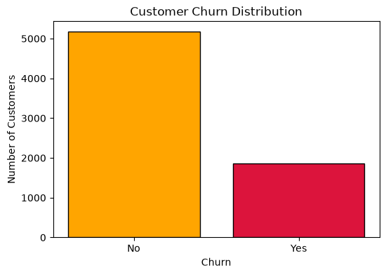

# Customer-Churn-Prediction

# Customer-Churn-Prediction

## Exploratory Data Analysis (EDA)

### 1. Customer Churn Distribution

### Observation:

- The dataset contains 73.46% non-churn customers and 26.54% churn customers.
- The target variable is moderately imbalanced.
- Accuracy alone may not be a reliable evaluation metric, so we will also consider Precision, Recall, F1-score, and ROC-AUC.

### Gender vs Churn

Observation:

- Churn distribution between male and female customers appears similar.
- Gender alone may not be a strong predictor of customer churn.
- Other features such as contract type, tenure, and monthly charges may have stronger influence.

### Contract Type vs Churn

Observation:

- Customers with month-to-month contracts show significantly higher churn compared to one-year and two-year contracts.
- Long-term contracts appear to improve customer retention.
- Contract type is likely an important feature for predicting churn.

### Internet Service vs Churn

Observation:

- Customers using Fiber optic service show a higher churn rate compared to DSL and customers without internet service.
- Internet service type may influence customer satisfaction and retention.
- This feature can be useful for churn prediction.

### Payment Method vs Churn

Observation:

- Customers using **Electronic check** have a higher churn rate compared to other payment methods.
- Customers using automatic payment methods such as **Bank transfer (automatic)** and **Credit card (automatic)** show lower churn behavior.
- This suggests that payment convenience and customer commitment may influence retention.
- Payment method can be considered an important feature for predicting customer churn.

### Tenure vs Churn

Observation:

- Customers with shorter tenure show a higher tendency to churn compared to long-term customers.
- Customers who have stayed with the company for longer periods appear more loyal.
- Tenure is likely an important predictive feature for customer churn.

### Monthly Charges vs Churn

Observation:

- Customers with higher monthly charges show a greater tendency to churn compared to customers with lower charges.
- Higher charges may indicate expensive services, which can influence customer satisfaction.
- Monthly charges can be an important numerical feature for churn prediction.

### Total Charges vs Churn

Observation:

- Customers with lower total charges show a higher tendency to churn.
- This may be because newer customers have not built a long-term relationship with the company yet.
- Total charges is related to tenure, since customers who stay longer generally accumulate higher total charges.
- This feature can provide useful information for churn prediction.

### Correlation Heatmap

Observation:

- Tenure and TotalCharges show a strong positive relationship because customers who stay longer accumulate higher total charges.
- MonthlyCharges and TotalCharges also have a positive relationship.
- Churn has a negative relationship with tenure, suggesting newer customers are more likely to leave.
- Numerical features provide useful information for the classification model.
