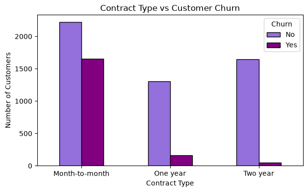
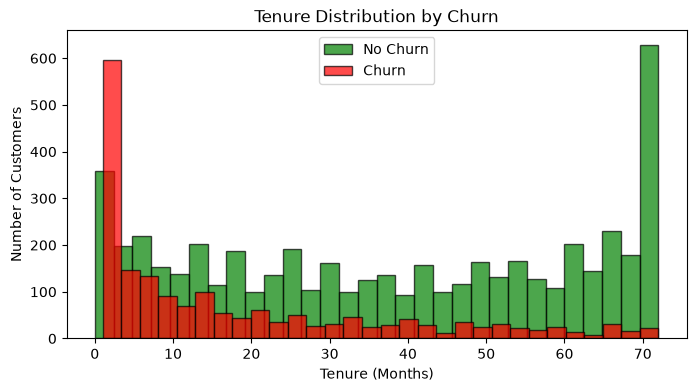
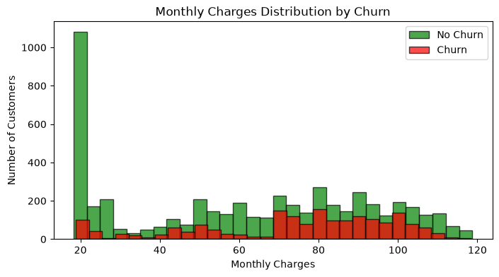
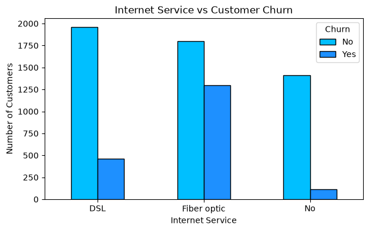
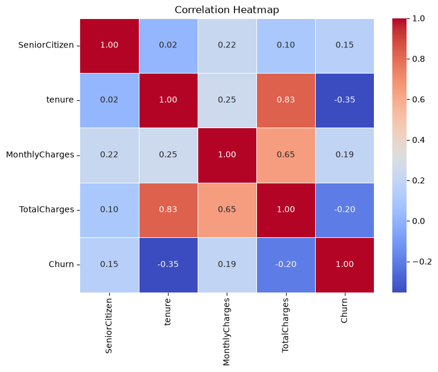

# 📊 Customer Churn Prediction Dashboard

An end-to-end Machine Learning application that predicts whether a telecom customer is likely to **churn**, and explains *why* — built with a clean, modular pipeline and a production-style Streamlit interface.

🔗 **[Live Demo → talha-churn-predictor.streamlit.app](https://talha-churn-predictor.streamlit.app)**


---

## 📌 Overview

Customer churn — when a subscriber leaves a service — is one of the most expensive problems in the telecom industry. Acquiring a new customer costs far more than retaining an existing one, which makes early, explainable churn prediction genuinely valuable.

This project builds a complete ML system around that problem:

- Cleans and prepares the **IBM Telco Customer Churn** dataset
- Trains and compares **7 classification algorithms**
- Tunes the best-performing model with cross-validated hyperparameter search
- Wraps everything in a single deployable **sklearn Pipeline** (no train/serve skew)
- Serves predictions through an interactive, explainable **Streamlit dashboard**

It's designed to demonstrate the kind of engineering discipline expected in a real ML team, not a notebook-only tutorial.

---

## 🖼️ Dashboard Preview

### Predict Tab — Step-by-step customer input

| Customer Information | Services |
|---|---|
|  |  |

### Prediction Result — Confidence, risk, and recommendation


### Model Interpretability — Why the model predicted what it did


### Model & Dataset Tab


### About Tab


### Downloadable Prediction Report


---

## 📈 Exploratory Data Analysis

A few key patterns uncovered during EDA that directly informed feature choices and model interpretation:

| Churn Distribution | Contract Type vs Churn |
|---|---|
|  |  |

| Tenure Distribution by Churn | Monthly Charges by Churn |
|---|---|
|  |  |

| Internet Service vs Churn | Correlation Heatmap |
|---|---|
|  |  |

**Key findings:**
- Customers on **month-to-month contracts** churn at a dramatically higher rate than one/two-year contracts
- **Low tenure** (new customers) is one of the strongest churn signals — churn drops sharply as tenure increases
- **Fiber optic internet** customers churn more than DSL or no-internet customers
- **Higher monthly charges** correlate with higher churn risk
- `TotalCharges` and `tenure` are strongly correlated (0.83), as expected

More EDA visuals (gender, payment method, distributions) are available in [`EDA_images/`](EDA_images).

---

## 🧠 Model & Results

Seven algorithms were trained and compared inside identical `Pipeline` objects (same preprocessing, different classifier), then the top candidates were tuned with `RandomizedSearchCV` (5-fold cross-validation, F1-optimized):

| Model | Status |
|---|---|
| Logistic Regression | ✅ Tuned — **Best Model** |
| Random Forest | Tuned |
| Gradient Boosting | Tuned |
| Support Vector Machine | Tuned |
| Decision Tree | Baseline |
| Naive Bayes | Baseline |
| K-Nearest Neighbors | Baseline |

**Best model: Logistic Regression**

| Metric | Score |
|---|---|
| Accuracy | ≈ 80% |
| F1 Score | ≈ 0.60 |
| ROC AUC | ≈ 0.84 |

Ranking was done primarily by **F1 Score** (churn is an imbalanced problem, so plain accuracy is misleading), with ROC AUC and Accuracy as tie-breakers.

Because Logistic Regression is linear, the app also surfaces the model's **learned coefficients** for every prediction — showing which specific factors pushed that customer toward or away from churn.

---

## 🏗️ Architecture / Pipeline

```
Raw Data
   ↓
Data Cleaning (drop customerID, fix TotalCharges dtype, handle missing values)
   ↓
Feature Engineering
   ↓
ColumnTransformer
   ├── Numeric: SimpleImputer(median) → StandardScaler
   └── Categorical: SimpleImputer(most_frequent) → OneHotEncoder
   ↓
Stratified Train/Test Split (80/20, random_state=42)
   ↓
Train 7 Models (each inside Pipeline: preprocessor → classifier)
   ↓
Evaluate (F1 → ROC AUC → Accuracy)
   ↓
Hyperparameter Tuning (RandomizedSearchCV, 5-fold, F1-scoring)
   ↓
Save Best Pipeline (models/best_model.pkl)
   ↓
Streamlit App (loads Pipeline, predicts on raw input — no manual encoding)
```

The saved model is a **full pipeline**, preprocessing included — `app.py` never manually scales or encodes anything. It builds a raw-column DataFrame and calls `model.predict()` / `model.predict_proba()` directly, which eliminates an entire class of train/serve mismatch bugs.

---

## 📁 Project Structure

```
Customer-Churn-Prediction/
│
├── .streamlit/
│   └── config.toml                 # Dark theme configuration
│
├── data/
│   └── WA_Fn-UseC_-Telco-Customer-Churn.csv
│
├── models/
│   └── best_model.pkl              # Final tuned pipeline (preprocessing + classifier)
│
├── src/
│   ├── app.py                      # Streamlit dashboard (UI + inference only)
│   ├── data_preprocessing.py       # Loading, cleaning, splitting, preprocessing
│   ├── eda.py                      # Exploratory data analysis / visualizations
│   ├── train_models.py             # Trains multiple candidate models
│   ├── evaluate_models.py          # Evaluates & compares all trained models
│   ├── tunning.py                  # RandomizedSearchCV hyperparameter tuning
│   └── utils.py                    # Shared helper functions
│
├── EDA_images/                     # Exploratory analysis charts
├── Dashboard_Screenshots/          # App screenshots used in this README
│
├── requirements.txt
├── .gitignore
├── .gitattributes
├── LICENSE
└── README.md
```

Each file has a single responsibility — `data_preprocessing.py` never trains a model, `train_models.py` never evaluates, `app.py` never touches training or tuning logic. This keeps the pipeline easy to extend or swap pieces of without breaking the rest.

---

## ⚙️ Installation & Usage

**1. Clone the repository**
```bash
git clone https://github.com/talha-siddiqui137/Customer-Churn-Prediction.git
cd Customer-Churn-Prediction
```

**2. Create a virtual environment (recommended)**
```bash
python -m venv venv
venv\Scripts\activate      # Windows
source venv/bin/activate   # macOS/Linux
```

**3. Install dependencies**
```bash
pip install -r requirements.txt
```

**4. Run the dashboard**
```bash
streamlit run src/app.py
```

The app will open locally, and also print a network URL you can open from another device on the same Wi-Fi.

**Or just use the live version — no setup needed:**
👉 **https://talha-churn-predictor.streamlit.app**

---

## ✨ Dashboard Features

- Step-based workflow: Fill Information → Review Summary → Predict → Analyze Result → Download Report
- One-click **sample customer autofill** (high-risk / low-risk) for instant demoing
- Churn probability **gauge chart** and **donut breakdown** (Plotly)
- Automatic **risk level** classification (Low / Medium / High)
- **Model interpretability** — top coefficients driving each individual prediction
- Business recommendation cards based on the prediction
- Downloadable **text prediction report**
- In-session **prediction history**
- Graceful error handling — a bad input never crashes the app
- Cached model loading for fast startup
- Dark, modern SaaS-dashboard-style UI

---

## 🛠️ Tech Stack

`Python` · `pandas` · `NumPy` · `scikit-learn` · `Matplotlib` · `Streamlit` · `Plotly`

---

## 🚀 Future Improvements

- Add SHAP-based explanations for non-linear models (Random Forest, Gradient Boosting)
- Batch prediction via CSV upload
- Model monitoring / drift detection for production use
- CI pipeline to re-train and re-validate on new data automatically
- Add authentication for a private, multi-user version of the dashboard

---

## 👨‍💻 Author

**Talha Siddiqui**
Software Engineering Student · AI/ML & Data Science

- GitHub: [@talha-siddiqui137](https://github.com/talha-siddiqui137)
- LinkedIn: [talha-siddiqui137](https://www.linkedin.com/in/talha-siddiqui137/)
- Email: talha03182301690@gmail.com

If this project was useful to you, consider giving it a ⭐ — it helps a lot.

---

## 📄 License

This project is licensed under the **MIT License** — see the [LICENSE](LICENSE) file for details.
